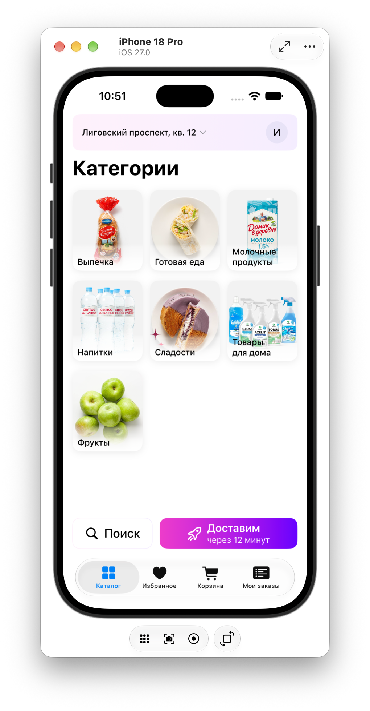
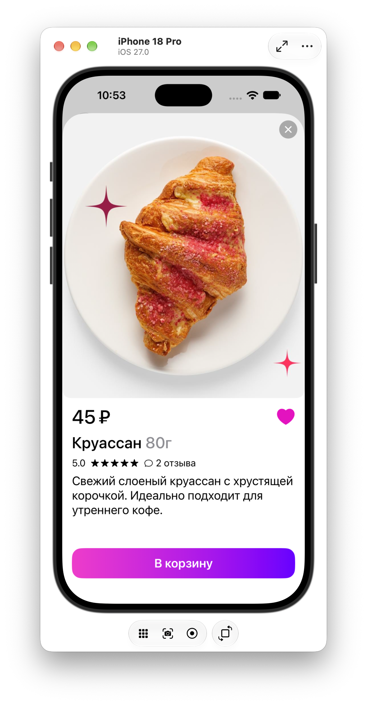
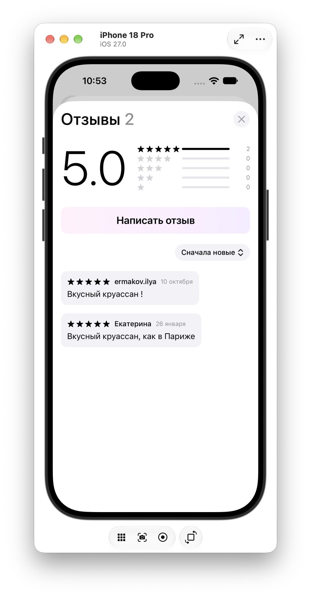
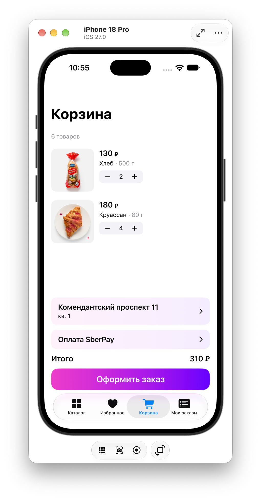
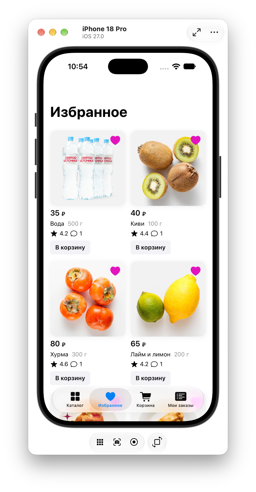
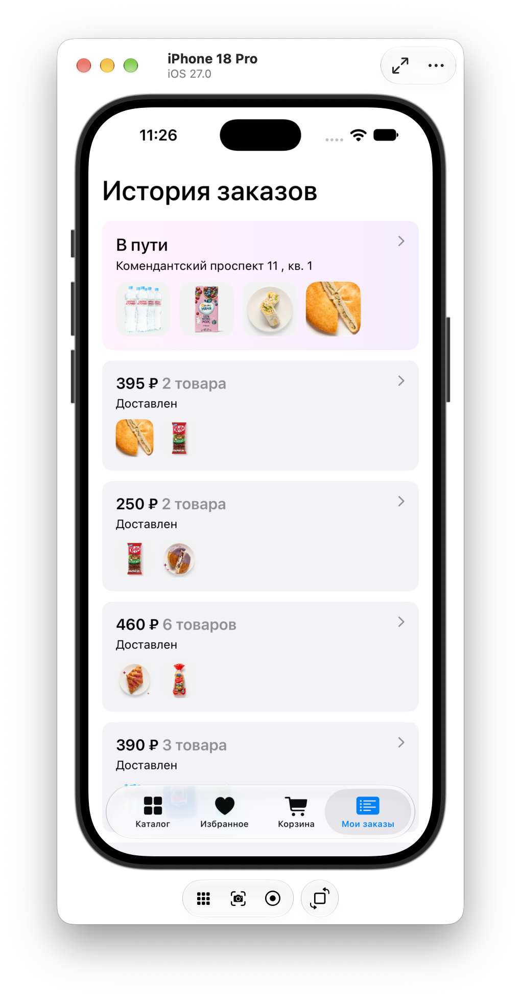

# WBDarkstore

Приложение доставки продуктов из дарксторов для iOS. Учебный проект курса WB Техношкола, написан на SwiftUI.

## Возможности

- Каталог категорий и товаров, поиск
- Карточка товара с отзывами (сортировка по дате и рейтингу), добавление отзыва
- Избранное
- Корзина с optimistic update и локальным кэшем (корзина восстанавливается при запуске)
- Оформление заказа и экран «Заказ оформлен»
- История заказов: активный заказ со статусом «В пути» и адресом, повтор заказа в один тап
- Профиль: редактирование имени и даты рождения, загрузка фото, выход, удаление аккаунта
- Адреса доставки: список, форма, выбор точки на карте
- Экран входа и анимированный лоадер при запуске

## Скриншоты

<p align="center">
  
  
  
</p>
<p align="center">
  
  
  
</p>

## Технологии

- **SwiftUI**, `@Observable`, `NavigationStack` с общим `Router`
- **Swift Concurrency**: `async/await`, `actor` (`CartActor`), `@MainActor`, `TaskGroup`
- **SwiftData**: локальный кэш корзины
- **OpenAPI**: клиент сгенерирован из `openapi.json` через swift-openapi-generator (транспорт на `URLSession`)
- **WBDesignSystemKit**: собственная дизайн-система в виде локального Swift-пакета (цвета, типографика, компоненты)
- Внедрение зависимостей через `ServiceLocator` и `@Environment`

## Архитектура

Слои разделены по папкам: `Views` (экраны), `Services` (сетевая и бизнес-логика), `Models`, `Navigation`. Состояние корзины изолировано в `actor`, а `CartService` и `ServiceLocator` работают на `@MainActor`, поэтому UI не читает данные из разных потоков.

## Требования

- Xcode 26 и iOS 26
- API-токен (инструкция ниже)

## Настройка API-токена перед запуском

Файл с токеном (`Token.swift`) не хранится в репозитории — он в `.gitignore`, чтобы не публиковать чувствительные данные.

### Как настроить:

1. Скопируйте `WBDarkstore/Services/Token.swift.example` в `WBDarkstore/Services/Token.swift`:
```bash
   cp WBDarkstore/Services/Token.swift.example WBDarkstore/Services/Token.swift
```

2. Откройте `Token.swift` и вставьте реальный токен вместо плейсхолдера:
```swift
   enum Secrets {
       static let apiToken = "ваш_реальный_токен_здесь"
   }
```

3. В Xcode добавьте `Token.swift` в проект (если не подхватился автоматически): ПКМ на папке `Services` → **Add Files to "WBDarkstore"...** → выберите `Token.swift`, убедитесь, что стоит галочка **Target: WBDarkstore**.

4. Соберите и запустите (`Cmd+R`).
